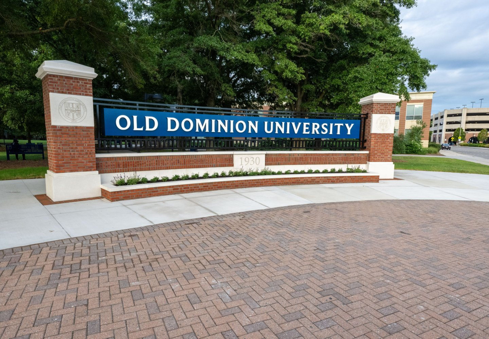

# HW# - EC 0.6 - Reports
### Martin Salisbury
### CS 432, Fall 2025
### 7 September 2025

# Q1

*You may copy the question into your report, but make sure that you make it clear where the question ends and your answer begins.*

## Answer

The image below is the new ODU sign.



*If you want to include code in your report, you can insert a screenshot (if it's legible), or you can copy/paste the code into a fenced code block.*

```python
s = "Hello World!"
print(s)
```

The table below shows the first 4 weeks of the class schedule.  

|Week|Date|Topic|
|:---|:---|:---|
|1|Aug 23|Introduction to Web Science and Web Architecture|
|2|Aug 30|Introduction to Python|
|3|Sep 6|Measuring the Web|
|4|Sep 13|Searching the Web|

The table below shows an example confusion matrix (you'll see this term later) from <https://en.wikipedia.org/wiki/Confusion_matrix>.

| | |Actual||
|---|---|---|---|
|**Predicted**| |Cat|Dog|
| |Cat|5 (TP)|3 (FP)|
| |Dog|2 (FN)|3 (TN)|

*You must provide some discussion of every answer. Discuss how you arrived at the answer and the tools you used. Discuss the implications of your answer.*

# Q2

## Answer

# Q3

## Answer

# References

*Every report must list the references that you consulted while completing the assignment. If you consulted a webpage, you must include the URL.  These are just a couple examples.*

* "Web Science: An Interdisciplinary Approach to Understanding the Web", <https://cacm.acm.org/magazines/2008/7/5366-web-science/fulltext>
* "Accessing the Deep Web", <http://dx.doi.org/10.1145/1230819.1241670>
* "Architecture of the World Wide Web, Volume One", <https://www.w3.org/TR/webarch/>
